intronSeeker
============

While sequencing mRNA non-spliced introns are often retained and therefore 
present in the produced reads. These introns coming from to non mature mRNAs 
create rupture in the proteins found in the transcripts. In order to get the 
correct protein sequence they have to be removed,
These retained introns will be present in only some sequences nevertheless they 
can therefore be present in the assembled contigs built from those reads.  


The read splicing signal of these introns can be used to find and remove them. 
The intron splice site boundaries (canonical or not), the Open Reading Frame size
and the protein alignment can be used as different hints to measure the probabiliy
of having a retained intron.

We developped a tool to identify potentially retained introns in 
*de novo* RNA-seq assembly  in order to quantify and remove them.

This tool includes two types of RNA-seq data simulations to validate the 
detection process and measure the false positive detection rate. 

The first simulation module uses random sequence simulation in order to check if 
splice aligners are able to find inserted introns when only contigs with introns and reads
whithout intron are used as well as when contigs with and without introns and reads without introns are used.

The second simulation is based on an existing genome and corresponding genome annotation. 
In this case the simulator produces reads with an without intron as well as 
transcripts with and whithout introns. This modules enables to verify the fraction 
of retained introns which can be detected in real condition and and set the 
appropriate detection thresholds.

Simulator and simulation data descriptions can be found in the SIMULATION.md file located in doc directory 
[here](./doc/SIMULATION.md)

How it works ?
--------------

#### Searching for introns


1. Use [Star](https://github.com/alexdobin/STAR) or 
[Hisat2](https://ccb.jhu.edu/software/hisat2/index.shtml) to map reads on 
assembled contigs.

2. Search splice events in bam file using CIGAR string.

3. Write a file of intron candidats. 

How to install ?
----------------

To install intronSeeker, see the INSTALL.md file [here](./INSTALL.md)

How to use ? 
------------

Here, we'll present a non-exhaustive documentation on how to use the intronSeeker 
program. For an exhaustive documentation about the different functions 
(description, options...), read the HOW TO USE file in doc directory. 
We'll just present a fast and basic usage with examples of the program. All the 
input files or output files presented here are available in data directory. 

Before running any intronSeeker command, activate the conda environment with :

```diff
conda activate ISeeker_environment
```

##### Reads alignment on reference contigs : Hisat or Star.

From here, we will use files corresponding to reduced real dataset available 
in the data directory (this data comes from *Ceanhorhabditis elegans*). 


intronSeeker can use two aligners : STAR and Hisat2. Hisat2 gives better alignment
results but takes longer to run and works only with paired-end library.

Running alignment, use the commands :

```diff
intronSeeker starAlignment -r data/Reduced_real_dataset/Test_set_Cele_contig-assembly.fasta -1 data/Reduced_real_dataset/Test_set_Cele_reads-1.fastq.gz -2 data/Reduced_real_dataset/Test_set_Cele_reads-2.fastq.gz -o data/Reduced_real_dataset/Cele_library-contigs_starAlignment
```

or 

```diff
intronSeeker hisat2Alignment -r data/Reduced_real_dataset/Test_set_Cele_contig-assembly.fasta -1 data/Reduced_real_dataset/Test_set_Cele_reads-1.fastq.gz -2 data/Reduced_real_dataset/Test_set_Cele_reads-2.fastq.gz -o data/Reduced_real_dataset/Cele_library-contigs_HISAT2Alignment
```


##### Splicing event search 

When the alignment is ended, you can search for splicing events with :

```diff
intronSeeker splitReadSearch -a data/Reduced_real_dataset/Cele_library-contigs_HISAT2Alignment/hisat2.sort.bam -r data/Reduced_real_dataset/Test_set_Cele_contig-assembly.fasta -o data/Reduced_real_dataset/Test_Cele_splicing_event_HISAT2
```

##### List features by FASTA trimming

When trimFastaFromTXT produces a new FASTA reference file where features, listed in candidats file, are trimmed from the reference FASTA.

```diff
intronSeeker trimFastaFromTXT -r data/Reduced_real_dataset/Test_set_Cele_contig-assembly.fasta -c data/Reduced_real_dataset/Test_Cele_splicing_event_HISAT2/srs_candidates.txt -o data/Reduced_real_dataset/Test_Cele_trimFASTA
```

##### Generate a intronSeeker simulation report

Create a configuration file buildReport_example.cfg :

```diff
[Defaults]
 fasta:data/Reduced_real_dataset/Test_set_Cele_contig-assembly.fasta
 r1:data/Reduced_real_dataset/Test_set_Cele_reads-1.fastq.gz
 r2:data/Reduced_real_dataset/Test_set_Cele_reads-2.fastq.gz
 flagstat:data/Reduced_real_dataset/Cele_library-contigs_HISAT2Alignment/hisat2.sort.flagstat.txt
 candidat:data/Reduced_real_dataset/Test_Cele_splicing_event_HISAT2/srs_candidates.txt
 split:data/Reduced_real_dataset/Test_Cele_splicing_event_HISAT2/srs_split_alignments.txt
 prefix:prefix
 threads:6             
 output:HTML/
 force: -F
```

```diff
    intronSeeker buildReport -F --config_file data/Reduced_real_dataset/buildReport_example.cfg 
```

Your HTML simulation report is available in HTML directory.

## Wrappers description

|  Program / wrapper    |     Description      |      
| :---    |         :--- |
|  checkInstall |          check intronSeeker installation               |       
|     simulateReads    |      produces a single or paired short  reads files from a contig file  |             
|  starAlignement    |     aligns with STAR single or paired fastq files to a contig file     |  
|  hisat2Alignment  |          aligns with hisat2 single or paired fastq files to a contig file |                                                          
|      fullRandomSimulation |      produces a random reference contig fasta file with an without inserted introns                             parameters                          |    
 |     GTFbasedSimulation     |    randomly selects transcripts and retained introns in a transcriptome                                       genome fasta and GTF files    |              
|      splitReadSearch    |        produces a split event table from an alignment file   |              
 |     trimFasta            |      removes introns from a contig file using split events       |                         
 |     analyzeORF       |          calculates longest ORF for each contig of a fasta fil     |                
|      analyseProtein   |          Produces longest protein alignment for each contig of a fasta file given a reference protein fasta file              |      
 |     searchIntrons  |            runs alignment, split read search and trim fasta               |     
|      checkIntrons        |       runs ORF and protein analysis on both contigs before and after intron removal      |     

Table: intronSeeker programs and wrappers.

# Files formats

## Candidats file format

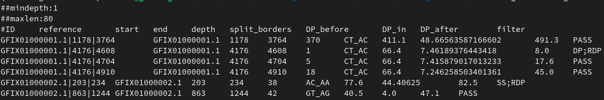

|  Column  | Fields  |        Type   |  Description|
| :---    |    :----:    |    :----:   |          ---: |
|  1  |      ID  |            String |  Candidat named by contigstart end |
|  2  |      reference |      String  | Contig name.|
|  3   |     start    |       Int |     Start position of the candidat.|
|  4  |      end   |          Int  |    End position of the candidat.|
|  5   |     depth   |        Int   |   Number of reads by candidat (depth).|
|  6  |      split_borders |  String |  Junction sites. If split borders are GT_AC (donor site) or CT_AC (acceptor site) , then these junctions are canonic.|
| 7    |    DP_before   |    Int |     Mean depth for 10bp before the candidate.|
|  8    |    DP_in  |         Int  |    Mean depth of candidate.|
|  9   |     DP_after  |      Int |     Mean depth for 10bp after the candidate.|
|  10    |   filter   |       String |  Filter candidates according to a minimum depth (DP), a maximum length (LEN), canonical junction (SS), or PASS introns.|

Table: Candidat file description.


## Split file format

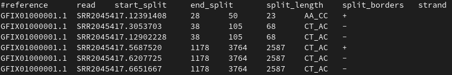


|  Column |  Fields     |     Type  |   Description|
| :---    |    :----:   |    :----: |         ---: |
|  1      |  reference  |    String |  Contig name.|
|  2      |     read    |    String |  Read name.  |
|3        |  start_split|   Int     |   Start position of the split read.|
|4        |  end_split  |   Int     |   End position of the split read.|
|5        |split_length |  Int      |    Length of split read.|
|6        |split_borders|  String   | Junction sites. If split borders are GT_AC (donor site) or CT_AC (acceptor site) , then these junctions are canonic.|
| 7       | strand       |   String |  Defined as + (forward) or - (reverse).|

Table: Split file description.


## Trimmed FASTA

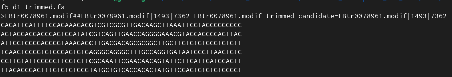

Contig without retained intron(s)


|   Line  |  Name    |                Type  |    Description| 
| :---    |    :----:   |    :----: |         ---: |
|   1   |    Sequence description |   String |   Sequence name, start, stop and trimmed sequence name, start, stop.| 
|   2  |     Fasta sequence   |       String  |  Trimmed fasta sequence| 

Table: Trimmed fasta file description.


# IntronSeeker report

Each section of the HTML report corresponds to an  intronSeeker step.

## IntronSeeker menu

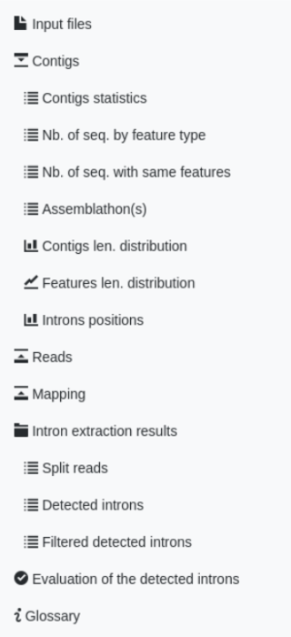

## Inputs files list and description

First simulation report's tab aims to check input files names listed in buildReport.cfg config file or in parameters.

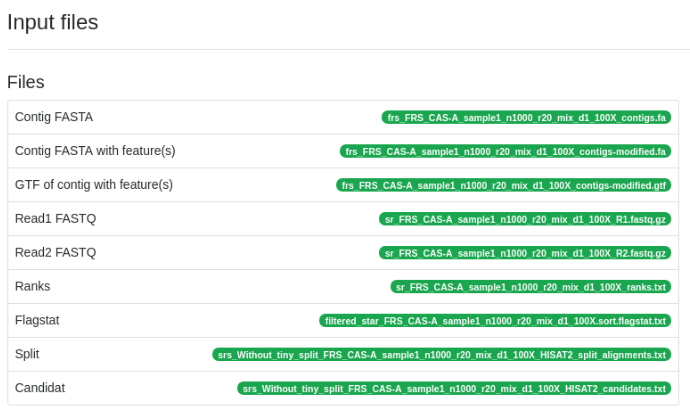

A glossary provides definitions of the main terms used in the HTML report:

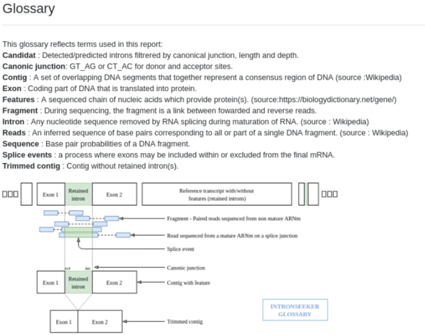

Statistics and description of input files from data simulation step, and statistics from FASTA, modified FASTA, GTF and assemblathon files.

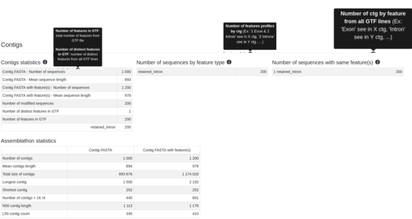

Graphical representation of statistics below

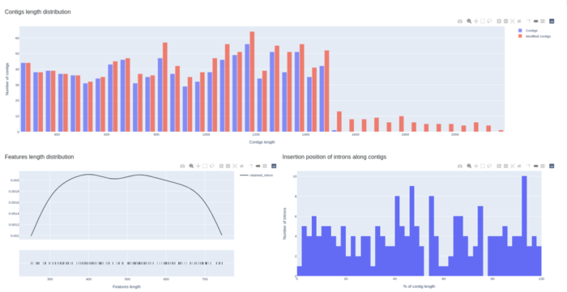

Statistics from intronSeeker alignment step (STAR): Reads statistics from R1 (and R2) fastq file(s), alignment statistics from flagstat file.

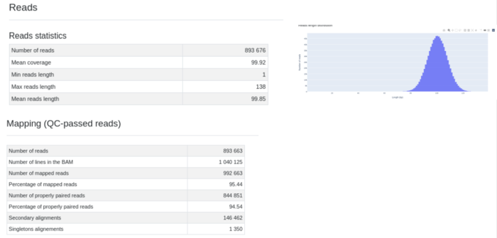

Warning: Mix-state parameter increase number of secondary alignments (with and without introns, with and without splicing).

## Intron extraction results

Statistics from intronSeeker splitReadSeach step.


The depth is the number of reads overlapping an intron. Difference between split mean length and detected intron mean length could be explain by the fact that several reads split on a same location so one candidat have several splits.

Evaluation of detected introns:


Detected introns filtered from candidat file and detectable introns from GTF and modified FASTA files, filtered  according to threshold (a minimum depth (DP) and a maximum length (LEN)), canonical junction (SS), and the number of PASS introns.

Top 10 of contigs having the highest number of detected introns tab list contig name, number of detected introns (filtered detected introns), and number of detectable introns (filtered features).

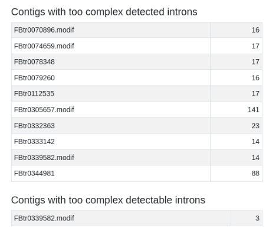

Evaluation of detected introns

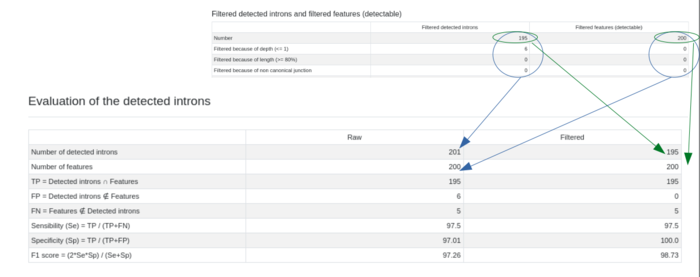

« Number of detected introns » / « raw » = Total number (PASS + DP + LEN + SS) of introns listed in candidat file.

« Number of detected introns » / «filtered» = Only « PASS » introns listed in candidat file.

« Number of features » / « raw » = Total number (PASS + DP + LEN + SS) of introns listed in GTF + modified fasta files.

« Number of features » / «filtered» = Only « PASS » listed in GTF + modified fasta files.

Evaluation/prediction of detected introns

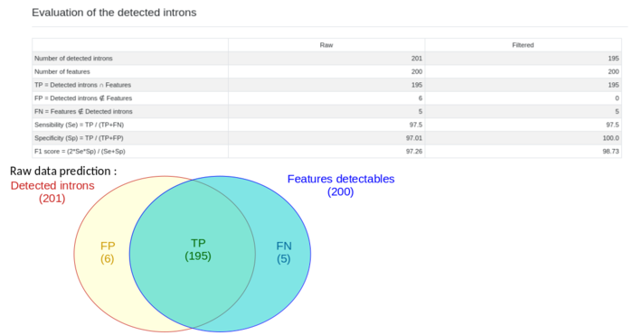

Sensibility is the fraction of \"detected filtered\" (201) presents in «Truth » (200) found by intronSeeker (195). Specificity is the fraction of truth « detected filtered » among all predicted.

#  IntronSeeker standard filters

By running several simulations and then searching for introns in real data, we were able to define standard filters.

Introns from candidat file have been detected and filtered according to a minimum depth, a maximum length and split borders should be canonicals.

Too complex introns are also filtered. An intron is too complex whether because of its size or because its an overlapping intron.


|  Filter name |  Description|
| :---    |         :--- |
|  DP      |      Filtered because of depth (). Candidates will be flagged if not supported by more than \[1\] read.|
|  LEN       |    Filtered because of length (%). Remove transcript if intron length greater than 80% of the total exons length|
|  SS     |       Filtered because of non canonical junction.|
|  OI   |         Filtered because of overlapping introns.v
|  RDP       |    if (DP_before + DP_after)/2 /5 \< DP_in|
|  PASS  |        After filtering, candidates are flagged PASS.|

Table: IntronSeeker introns filters.

# GitLab CI/CD pipeline

"Runner for intronSeeker project" and .gitlab-ci.yml file at the root of this repository are available to run intronSeeker jobs.
To run an intronSeeker pipeline, please choose "Pipelines" from the right-hand menu, clic "Run pipeline" on the left, run for branch "run_pipelines_tests", then clic "Run pipeline".
Your pipeline is running and you can follow each stage in progress thanks to "Pipelines" menu.
