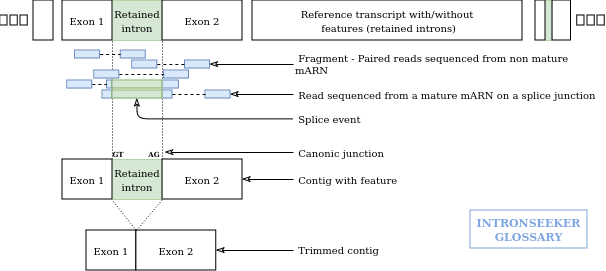

intronSeeker
============

While sequencing mRNA non-spliced introns are often retained and therefore 
present in the produced reads. These introns coming from to non mature mRNAs 
create rupture in the proteins found in the transcripts. In order to get the 
correct protein sequence they have to be removed,
These retained introns will be present in only some sequences nevertheless they 
can therefore be present in the assembled contigs built from those reads.  


The read splicing signal of these introns can be used to find and remove them. 
The intron splice site boundaries (canonical or not), the Open Reading Frame size
and the protein alignment can be used as different hints to measure the probabiliy
of having a retained intron.

We developped a tool to identify potentially retained introns in 
*de novo* RNA-seq assembly  in order to quantify and remove them.

This tool includes two types of RNA-seq data simulations to validate the 
detection process and measure the false positive detection rate. 

The first simulation module uses random sequence simulation in order to check if 
splice aligners are able to find inserted introns when only contigs with introns and reads
whithout intron are used as well as when contigs with and without introns and reads without introns are used.

The second simulation is based on an existing genome and corresponding genome annotation. 
In this case the simulator produces reads with an without intron as well as 
transcripts with and whithout introns. This modules enables to verify the fraction 
of retained introns which can be detected in real condition and and set the 
appropriate detection thresholds.

Simulator and simulation data descriptions can be found in the SIMULATION.md file located in doc directory 
[here](./doc/SIMULATION.md)

How it works ?
--------------

#### Searching for introns


1. Use [Star](https://github.com/alexdobin/STAR) or 
[Hisat2](https://ccb.jhu.edu/software/hisat2/index.shtml) to map reads on 
assembled contigs.

2. Search splice events in bam file using CIGAR string.

3. Write a GFF file of intron candidate. 

How to install ?
----------------

To install intronSeeker, see the INSTALL.md file [here](./INSTALL.md)

How to use ? 
------------

Here, we'll present a non-exhaustive documentation on how to use the intronSeeker 
program. For an exhaustive documentation about the different functions 
(description, options...), read the HOW TO USE file in doc directory. 
We'll just present a fast and basic usage with examples of the program. All the 
input files or output files presented here are available in data directory. 

Before running any intronSeeker command, activate the conda environment with :

```diff
+ source activate ISeeker_environment
```

##### Reads alignment on reference contigs : Hisat or Star.

From here, we will use files corresponding to reduced real dataset available 
in the data directory (this data comes from *Ceanhorhabditis elegans*). 


intronSeeker can use two aligners : STAR and Hisat2. Hisat2 gives better alignment
results but takes longer to run and works only with paired-end library.

Running alignment, use the commands :

```diff
+ intronSeeker starAlignment -r Test_set_Cele_contig-assembly.fasta -1 Test_set_Cele_reads-1.fastq.gz -2 Test_set_Cele_reads-2.fastq.gz -o Cele_library-contigs_alignment
```

or 

```diff
intronSeeker hisat2Alignment -r Test_set_Cele_contig-assembly.fasta -1 Test_set_Cele_reads-1.fastq.gz -2 Test_set_Cele_reads-2.fastq.gz -o Cele_library-contigs_alignment
```


##### Splicing event search 

When the alignment is ended, you can search for splicing events with :

```diff
+ intronSeeker splitReadSearch -a Cele_library-contigs_alignment_hisat2/Cele_library-contigs_alignment.Aligned.sortedByCoord.out.bam -r Test_set_Cele_contig-assembly.fasta -o Test_Cele_splicing_event
```
