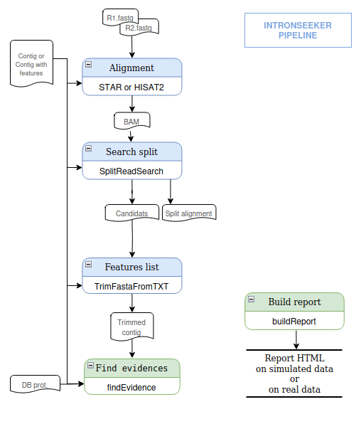

---
author:
- Sarah Maman
- Philippe Bardou
- Emilien Lasguignes
- Faustine Oudin
- Floréal Cabanettes
- Christophe Klopp
bibliography:
- IntronSeeker.bib
title: Finding and removing introns from RNA-Seq de novo assemblies with
  IntronSeeker
---

# Introduction {#introduction .unnumbered}

Short read RNA sequencing (RNA-Seq) is now routinely used to study gene
expression. When reference genome and transcriptome are available, reads
can be splice-aligned to the genome and gene abundances can be measured
by counting reads matching each gene location or they can be quantified
without alignment using the presence of gene specific kmers. When no
reference genome or transcriptome is available, reads are usually
assemble to build a reference contig set. In this de novo approach reads
are then aligned to the reference contigs without using a splice-aware
aligner because they originate from mature transcripts.

In order not to sequence very abundant ribosomal RNAs, commonly used
protocols include oligo(dT) transcript enrichment. Transcript
poly-adhenylation and splicing take place in the nucleus before transfer
in the cytoplasm. PolyA tail selection retrieves mainly mature spliced
transcripts. Introns spanning reads are still found in most RNA-Seq
samples as shown by  [@Ameur2011].

Intron retention is also a known biological gene regulation or
alternative splicing mechanism. In plants it has been shown to increase
the number of transcript splicing forms  [@Jia2020].
 [@Braunschweig2014] have shown that even in mammals their is widespread
intron retention and its link to gene expression regulation.

Reads located on intron/exon boundaries harbor specific splice motifs.
These splice motifs are di-nucleotides located at both intron ends. They
can be canonical (GT/AG) or not. Canonical motifs are found in most site
of most species.

Intron retention can be seen as an artefact or a biologically relevant
mechanism and in both cases it is interesting to monitor it in RNA-Seq
data sets. This is easy when having a reference genome because one can
quantify reads aligned on introns. This is more complicated in a de novo
approach in which the assembler can produce contigs with and without
intron for the same transcript.

Contigs with introns are more difficult to annotated because introns are
splitting coding sequences (CDS) and possibly generating several shorter
protein alignments rather than a unique long match.

Canonical splice motifs presence, number of reads splicing at the same
location, the minimum number of splice events and overlaps (XXXXXXX) can
be used to reduce faulty detection.

Hereafter we present IntronSeeker a software package enabling to search
and remove introns from de novo assembled RNA-Seq reads.

# Implementation {#sec:implementation .unnumbered}

## General overview {#general-overview .unnumbered}

IntronSeeker is a python script which includes three steps enabling to
align read on contigs, find and remove retained introns and produce an
html report. Figure 1. presents theses steps with input and output file
formats.

IntronSeeker is open source (licence) and can be download from
<http://github.com/>

<figure id="fig:intronseeker_pipeline">

<figcaption>IntronSeeker steps diagram.</figcaption>
</figure>

## Conda based installation procedure {#conda-based-installation-procedure .unnumbered}

To ease installation, intronSeeker includes an installation script
(setup.sh) which run the installation of all the dependencies (1) but
one (grinder) using conda and then installs grinder in the conda
environment. Conda has to be installed beforehand. Installation can be
checked using intronSeeker checkInstall program which will verify the
presence and version of all dependencies. To run intronSeeker one has
first to load the ISeeker_environment using conda 'source activate
ISeeker_environment' command. An example data set named
reduced_real_dataset is also provided in the data directory. It includes
the result files which will enable manual comparison of the reference
and produced intron files after complying the test. The installation
procedure and the test command line can be found on the main page of the
intronSeeker GITHUB WEB-page.

\(1\) IntronSeeker dependencies include seven software packages :
grinder [@angly2012grinder], gffread [@gffread], hisat2 [@kim2015hisat],
STAR [@dobin2013star], samtools [@li2009sequence],
TransDecoder [@haas2013novo], diamond [@buchfink2015fast].

# Material and methods {#sec:matandmeth .unnumbered}

Several analysis have been performed while developing IntronSeeker in
order to select an aligner able to splice align reads even if both
contigs with and without intron are present in the reference, to set the
correct parameters to collect only correct retained intron, reduce false
positive rate, check impact of removing retained on protein completeness
and finally to verify that public data sets present retained intron
candidates. This section will first present how public data validation
was performed before entering in the details of aligner selection and
parameter setting.

## Finding retained introns in public datasets {#finding-retained-introns-in-public-datasets .unnumbered}

NCBI TSA (Transcriptome Shotgun Assembly) contains over six thousand
publicly available RNA-Seq de novo assembled contig sets for various
species from different reigns. It also includes the link to the SRA
(Short Read Archive) read set which were used for these de novo
assemblies. We selected twenty different TSA contig sets and one of
their SRA read set corresponding to the species presented in table 2 and
ran IntronSeeker with default parameters on these sets. A command line
example can be found in Supp. 1 (Supplementary material appendix 1). The
corresponding result files can be downloaded from (data inrae : URL TO
COMPLETE
http://genoweb.toulouse.inra.fr/ smaman/intronSeeker/DATA-INRAE/). The
rate of contigs containing at least an intron candidate was extracted
from the result file and collected in table 2.

## Measuring intron removal impact on protein completeness {#measuring-intron-removal-impact-on-protein-completeness .unnumbered}

For four species *Caenorhabditis elegans*, *Drosophila melanogaster*,
*Arabidopsis thaliana* and *Gallus gallus* we simulated thousand contigs
and half a million read pairs from the Ensembl (version) genome FASTA
and annotation GTF files with the IntronSeeker GTF Based Simulation for
the contig FASTA generation and the reads simulation to generate FASTQ
files(XXXsimulate function). This genome based simulation strategy is
called GBS (Genome Based Simulation). The module outputs a bed file
storing which intron of the transcript is retained enabling to check if
IntronSeeker was able to detect it. For all transcripts in which the
retained intron was overlaping the coding sequence (CDS), we compared
protein completeness of the contigs before and after cleaning them with
IntronSeeker. The results are presented in table XXX.

## Selecting a splice aligner to discover retained introns in de novo transcriptome contigs {#selecting-a-splice-aligner-to-discover-retained-introns-in-de-novo-transcriptome-contigs .unnumbered}

Two full random simulations (FRS) were performed. In this simulation
mode contigs are simulated by random picking nucleotides in a uniform
distribution. In the first simulation, called no-mix, ten sets
containing each thousand contigs with introns were randomly generated
with the IntronSeeker FullRandomSimulation function. This function
outputs two contig fasta files, the first without intron and the second
with introns, as well as a bed file with the intron locations in the
with-intron file. The without-intron file is used to simulate reads in
the following step. For both sets, contig metrics where calculated with
the assemblathon_stats.py script. hundred fold read pair coverage was
simulated for each set using the simulateReads function with default
parameters. Reads pairs were then aligned to both contig sets with the
IntronSeeker Alignment function using both STAR and HiSAT2 options. The
resulting bam files were parsed to count reads having a splice pattern
(block of N in the cigarline) corresponding to the intron location.

In the second simulation, called mix, the same protocol was applied but
this time the contigs with and whitout introns, five hundred of each,
were mixed in the reference set. Meaning that each contig was present in
its with-intron and without-intron forms. This to check if the aligner
is able to produce a splice alignment even if the reference without
intron is available.

Results of both simulations were gathered in Figure 2.

## Setting default detection parameters {#setting-default-detection-parameters .unnumbered}

Detected introns are filtered according to thresholds (number of reads
overlapping an intron and maximum length), canonical junction (GT_AG or
CT_AC), and complexity (too long or overlapping introns).

Different GBS simulations where performed to find the best possible
thresholds for minimum number of splice events, maximum intron spanning
size, presence of canonical splice sites and minimum overlap size to
call a splice event an intron retention candidate.

::: {#tab:widgets2}
  ------------------------------------------
  
  ------------------------------------------

  : IntronSeeker parameters impacts. Graphics have been built on 10
  samples of Arabidopsis thaliana data with powerlow abundance (1.2).
:::

::: tablenotes
A Coverage impact on detection: Increasing the coverage allows to
quickly lose false candidates with a very limited impact on the number
of true candidates (Arabidopsis thaliana data, powerlow abundance).\

B Filter candidates on border improve detection. DPratio =
DPin/(DPbefore+DPafter)\

C Filter candidates on candidat length.\

D Filter candidates on retained intron ratio (long contig / long
candidat).\
:::

::: {#tab:widgets2}
                                          Cele    Dmel    Ggal    Athal
  --------------------------------------- ------- ------- ------- -------
  Nb True with non canonical junctions    3       0       1       1
  Nb True with canonical junctions        6 018   5 242   5 545   2 711
  Nb False with non canonical junctions   250     36      419     18
  Nb False with canonical junctions       835     692     1 575   535

  : Filter on canonical junctions.
:::

Maximum intron length.\

## Defining an retained intron correction strategy from real data sets {#defining-an-retained-intron-correction-strategy-from-real-data-sets .unnumbered}

Public de novo transcriptome projects include often several read sets
corresponding to different conditions or replicates. Searching retained
introns with several independent sets will give partially overlapping
lists of candidates which can be merged in different ways such as only
considering candidates found in all lists or found at least in two
lists. We call this a correction strategy.

Four public TSA contigs sets of *Salvia miltiorrhizafor*, *Anguilla
anguilla*, *Gadus morhua* and *Drosophila miranda* having from three to
seven SRA reads sets have been processed with IntronSeeker using default
parameters and there candidats have been compared in Venn diagrams
produced with jvenn  [@bardou2014].

# Results {#sec:results .unnumbered}

## Searching retained introns in public datasets {#searching-retained-introns-in-public-datasets .unnumbered}

The twenty public TSA contigs sets processed by IntronSeeker are
classified in three Fungi, six Plantae, nine Animalia kingdoms and two
Eukaryote superkingdoms. The number of contig ranged from thirty
thousand to three hundred thousand. The number of reads ranged from six
millions to three hundreed thirty millions. The proportion of retained
intron candidates ranged from 0.02 to 11.96%. The figures are presented
in Table 1.

::: {#tab:widgets3}
  Species             (super)kingdom     TSA id Nb contigs   SRA reports                                                                                        Nb reads.       \% cwi
  ------------------- ---------------- -------- ------------ ---------------------------------------------------------------------------------------------- ------------- ------------
  Salvia m.           Plantae            GJJN01 69 705       [SRR15718805](http://genoweb.toulouse.inra.fr/~smaman/intronSeeker/DATA-INRAE/REAL-reports/)      23 086 599   **11.96%**
  Platichthys s.      Animalia           GAPK01 30 630       [SRR1023744](http://genoweb.toulouse.inra.fr/~smaman/intronSeeker/DATA-INRAE/REAL-reports/)      516 791 904   **10,71%**
  Rigidoporus m.      Fungi              GDMN01 34 441       [SRR2187438](http://genoweb.toulouse.inra.fr/~smaman/intronSeeker/DATA-INRAE/REAL-reports/)       75 600 628    **5,97%**
  Isatis t.           Plantae            GARR01 33 238       [SRR1051997](http://genoweb.toulouse.inra.fr/~smaman/intronSeeker/DATA-INRAE/REAL-reports/)      113 134 348    **5,41%**
  Goniomonas a.       Eukaryota          GGUN01 48 844       [SRR7601946](http://genoweb.toulouse.inra.fr/~smaman/intronSeeker/DATA-INRAE/REAL-reports/)       82 416 944    **5,27%**
  Vriesea c.          Plantae            GHCB01 41 228       [SRR500874](http://genoweb.toulouse.inra.fr/~smaman/intronSeeker/DATA-INRAE/REAL-reports/)        85 726 288    **3,94%**
  Graminella n.       Animalia           GAQX01 37 537       [SRR857257](http://genoweb.toulouse.inra.fr/~smaman/intronSeeker/DATA-INRAE/REAL-reports/)        43 693 708    **2,88%**
  Carassius g.        Animalia           GJKR01 109 966      [SRR12596368](http://genoweb.toulouse.inra.fr/~smaman/intronSeeker/DATA-INRAE/REAL-reports/)      21 661 960    **2.72%**
  Rhizopus a.         Fungi              GDUK01 30 601       [SRR2104505](http://genoweb.toulouse.inra.fr/~smaman/intronSeeker/DATA-INRAE/REAL-reports/)       64 801 576    **2,51%**
  Diplonema p.        Eukaryota          GJNJ01 114 037      [SRR14933372](http://genoweb.toulouse.inra.fr/~smaman/intronSeeker/DATA-INRAE/REAL-reports/)      63 775 926    **2.35%**
  Azolla f.           Plantae            GBTV01 36 091       [SRR1618559](http://genoweb.toulouse.inra.fr/~smaman/intronSeeker/DATA-INRAE/REAL-reports/)      122 059 452    **1,97%**
  Tripidium r.        Plantae            GJDA01 106 494      [SRR14143372](http://genoweb.toulouse.inra.fr/~smaman/intronSeeker/DATA-INRAE/REAL-reports/)      15 357 748    **1.50%**
  Cimex l.            Animalia           GBYH01 39 124       [SRR1660436](http://genoweb.toulouse.inra.fr/~smaman/intronSeeker/DATA-INRAE/REAL-reports/)      329 875 624    **1,24%**
  Trichoplax sp. H2   Animalia           GFSF01 43 376       [SRR5819939](http://genoweb.toulouse.inra.fr/~smaman/intronSeeker/DATA-INRAE/REAL-reports/)      128 665 904    **1,24%**
  Phytophthora c.     Plantae            GBGX01 21 662       [SRR1206033](http://genoweb.toulouse.inra.fr/~smaman/intronSeeker/DATA-INRAE/REAL-reports/)       14 346 946    **1.15%**
  Piromyces sp.       Fungi              GGXH01 124 096      [SRR7819335](http://genoweb.toulouse.inra.fr/~smaman/intronSeeker/DATA-INRAE/REAL-reports/)       15 615 535    **0.50%**
  Sander l.           Animalia           GJIW01 56 196       [SRR15372351](http://genoweb.toulouse.inra.fr/~smaman/intronSeeker/DATA-INRAE/REAL-reports/)      48 694 199    **0.36%**
  Rhodnius n.         Animalia           GJJI01 67 217       [SRR15602387](http://genoweb.toulouse.inra.fr/~smaman/intronSeeker/DATA-INRAE/REAL-reports/)       6 775 534    **0.11%**
  Choromytilus c.     Animalia           GJJD01 106 298      [SRR15058678](http://genoweb.toulouse.inra.fr/~smaman/intronSeeker/DATA-INRAE/REAL-reports/)      10 490 833    **0.10%**
  Bombus t.           Animalia           GHFS01 48 241       [SRR6148374](http://genoweb.toulouse.inra.fr/~smaman/intronSeeker/DATA-INRAE/REAL-reports/)       15 547 444    **0.02%**

  : Rates of public contigs with introns, data from NCBI Transcript
  Shotgun Archive (TSA) and Short Read Archive (SRA).
:::

::: tablenotes
NCBI taxonomy browser, superkingdom used when kingdom not provided.

Clic on SRR ids to display intronSeeker reports.

fraction of contigs with introns (cwi) = Nb of contigs PASS / Nb total
of contigs
:::

## Measuring intron removal impact on protein completeness {#measuring-intron-removal-impact-on-protein-completeness-1 .unnumbered}

Table or diagram provided by Philippe on the impact on protein
contiguity of removing retained introns.

## Selecting a splice aligner to discover retained introns in de novo transcriptome contigs {#selecting-a-splice-aligner-to-discover-retained-introns-in-de-novo-transcriptome-contigs-1 .unnumbered}

<figure id="fig:selecting_splicealigner">

 

<figcaption>STAR <em>versus</em> HISAT2 alignment results on two contig
sets : one containing only contigs with an intron (no mix) and the other
containing contigs with an intron and the same contig without intron
(mix). Primary non spliced alignments are shown in green, spliced
alignments in red and secondary non spliced alignments in
blue.</figcaption>
</figure>

Splice aligners enable to find introns from RNA-Seq de novo contigs
Mapping detection accuracy to find retained introns when only one
unspliced form exists in the contigs, on simulated FRS data. Both
mappers in the no-mix state align well, no noticeable difference between
the two.\
The aligners are designed to map to genomes but we notice that they also
splice correctly to transcript contigs.

Not all splice aligners have the same results : selected the best for
intron detection on simulated data. When there are sequences with and
without introns in an assembly, are the mappers able to identify the
retained introns ? Compared to secondary alignments, HiSat2 only
generates secondary alignments in the mixed state, and STAR generates
more secondary alignments than HiSat2. Compared to splits, quite
logically, we observe more splits with the mix option since the FASTA
file contains the transcript in both states (with and without retained
intron). In the mixed state, STAR splits much less than HiSat2.
According to sensibility, specificity and F1 score, HiSat2 detect more
introns than STAR. HiSat2 splits better, especially when the percentage
of retained intron increases. If a read overlaps introns, then the
aligner does not split. Thus, if the sequences are not split, the
features will not be mapped and therefore not detected.

Taking into account these criteria (number of splits, sensibility,
specificity, number of features detected), HiSat2 is better than STAR
for intron detection on simulated data. More introns detected with
HiSat2, especially when the number of sequences with retained introns
increase.

## Measuring the impact of intron removal on the protein completeness {#measuring-the-impact-of-intron-removal-on-the-protein-completeness .unnumbered}

XXXXX

## Setting detection parameters using simulated intron retention based on reference transcriptomes {#setting-detection-parameters-using-simulated-intron-retention-based-on-reference-transcriptomes .unnumbered}

Removing intron enable to improve protein integrity in contigs : table
showing for different GBS sample the number of protein in one piece
before and after intron removal by IntronSeeker

## Defining an retained intron detection strategy from real data sets {#defining-an-retained-intron-detection-strategy-from-real-data-sets .unnumbered}

::: {#tab:widgets2}
  Species (Clades)            Nb contigs (TSA)   Samples       Nb Seq       %Ir
  --------------------------- ------------------ ------------- ------------ ------------
  Salvia m.(Magnoliophyta)    69 705 (GJJN)      SRR13996120   22 503 120   **12.52**%
                                                 SRR15718796   20 169 850   **11.73**%
                                                 SRR15718799   18 291 366   **11.55**%
  Anguilla a. (Chordata)      60 179 (GFIC)      SRR1532756    19 688 393   **2.91**%
                                                 SRR1532757    35 234 589   **1.69**%
                                                 SRR1532758    19 061 539   **2.04**%
                                                 SRR1532760    21 815 169   **2.09**%
                                                 SRR1532761    17 971 382   **1.72**%
  Gadus m.(Chordata)          50 607 (GFIX)      SRR2045415    22 436 517   **3.39**%
                                                 SRR2045416    36 457 070   **1.51**%
                                                 SRR2045417    35 480 430   **1.80**%
  Drosophila m.(Arthropoda)   12 521 (GALP)      SRR364798     27 272 458   **0.08**%
                                                 SRR364799     13 522 671   **0.11**%
                                                 SRR364800     25 615 616   **0.08**%
                                                 SRR364801     32 719 471   **0.25**%
                                                 SRR364802     28 794 285   **0.17**%
                                                 SRR364803     13 682 311   **0.13**%
                                                 SRR364804     33 564 923   **0.25**%

  : Description of the different NCBI samples used.
:::

::: tablenotes
Intron retention rate (%Ir) = Nb tot PASS candidates / Nb tot of contigs
in the fasta.

Salvia miltiorrhiza BioProject PRJNA759933

Anguilla anguilla BioProject PRJNA256923

Gadus morhua BioProject PRJNA256972

Drosophila miranda BioProject PRJNA208862
:::

Different tissues give different introns. To compare tissues, all
samples are reduced to 20 million sequences of 75 nucleotides.

::: {#tab:widgets2}
  Anguilla a.                                               Salvia m.
  --------------------------------------------------------- ------------------------------------
     

  : Intron retention comparison for different tissues from Anguilla a.
  (Animalae) and Salvia m. (Plantae).
:::

::: tablenotes
Ovaries (SRR1532756), brain (SRR1532757) and muscles (SRR1532760) of
Anguilla anguilla, according to the number of PASS candidates.

Replicate of the same tissu from Henan (SRR13996120), from Shaanxi
(SRR15718796) and from Yunnan (SRR15718799) of Salvia miltiorrhiza,
according to the number of PASS candidates.
:::

Species behave differently according to their genome complexity.

The quality of the outputs depends on the complexity of the genome
considered.

::: {#tab:widgets2}
  Species   F1score mean   std deviation
  --------- -------------- ---------------
  Athal     99,12          0,48
  Cele      99,28          0,32
  Dmel      97,93          0,65
  Ggal      98,88          0,29

  : More or less complex genomes with repeats and noise (overlapping
  introns).
:::

We could plot sensitivity, specificity and F1 score in the same plot.
Remove the blue background. Enlarge the axis and the text to ease
reading. Set the y axis to 0 if not the message is less clear.

## Processing time {#processing-time .unnumbered}

::: {#tab:widgets4}
                      Salvia miltiorrhiza    Anguilla anguilla      Gadus morhua           Drosophila miranda
  ------------------- ---------------------- ---------------------- ---------------------- ----------------------
  Nb samples          3 fastq                5 fastq                3 fastq                7 fastq
  Nb tot sequences    2 \* 60 964 336        2 \* 113 771 072       2 \* 94 374 017        2 \* 175 171 735
  Nb contigs          69 705 contigs         60 179 contigs         50 607 contigs         12 521 contigs
  Nb PASS candidats   26 357                 6 299                  3 396                  137
  Elapsed time/mem                                                                         
  HiSat2 alignment    2:18:31 / 5.52 GB      5:57:51 / 6.86 GB      6:35:25 / 5.98 GB      4:01:27 / 1.89 GB
  Split Read Search   1-10:28:52 / 2.22 GB   1-16:07:04 / 3.22 GB   1-10:00:18 / 2.01 GB   00:59:14 / 608.43 MB
  HTML report         00:56:14 / 16.72 GB    01:21:36 / 26.67 GB    01:11:45 / 29.23 GB    01:49:08 / 25.94 GB

  : IntronSeeker processing time and memory consumption for NCBI
  datasets.
:::

::: tablenotes
Salvia miltiorrhiza BioProject PRJNA759933 TSA GJJN01

Anguilla anguilla BioProject PRJNA256923 TSA GFIC

Gadus morhua BioProject PRJNA256972 TSA GFIX

Drosophila miranda BioProject PRJNA208862 TSA GALP

Memory consumption is maximum RAM usage.
:::

## Data availability {#data-availability .unnumbered}

All data created or used during this study are openly available from
DATA INRAE Archive at https://data.inrae.fr/ DOI\....

http://genoweb.toulouse.inra.fr/ smaman/intronSeeker/DATA-INRAE/\

::: {#tab:widgets2}
  Species         Samples' intronSeeker reports
  --------------- -------------------------------------------------------------------------------------------------------------------------------
  Salvia m.       [SRR13996120](http://genoweb.toulouse.inra.fr/~smaman/intronSeeker/DATA-INRAE/REAL-reports/report_salvia_SRR13996120.html)
                  [SRR15718796](http://genoweb.toulouse.inra.fr/~smaman/intronSeeker/DATA-INRAE/REAL-reports/report_salvia_SRR15718796.html)
                  [SRR15718799](http://genoweb.toulouse.inra.fr/~smaman/intronSeeker/DATA-INRAE/REAL-reports/report_salvia_SRR15718799.html)
  Anguilla a.     [SRR1532756](http://genoweb.toulouse.inra.fr/~smaman/intronSeeker/DATA-INRAE/REAL-reports/report_Anguilla_CC_SRR1532756.html)
                  [SRR1532757](http://genoweb.toulouse.inra.fr/~smaman/intronSeeker/DATA-INRAE/REAL-reports/report_Anguilla_CC_SRR1532757.html)
                  [SRR1532758](http://genoweb.toulouse.inra.fr/~smaman/intronSeeker/DATA-INRAE/REAL-reports/report_Anguilla_CC_SRR1532758.html)
                  [SRR1532760](http://genoweb.toulouse.inra.fr/~smaman/intronSeeker/DATA-INRAE/REAL-reports/report_Anguilla_CC_SRR1532760.html)
                  [SRR1532761](http://genoweb.toulouse.inra.fr/~smaman/intronSeeker/DATA-INRAE/REAL-reports/report_Anguilla_CC_SRR1532761.html)
  Gadus m.        [SRR2045415](http://genoweb.toulouse.inra.fr/~smaman/intronSeeker/DATA-INRAE/REAL-reports/report_Gadus_SRR2045415.html)
                  [SRR2045416](http://genoweb.toulouse.inra.fr/~smaman/intronSeeker/DATA-INRAE/REAL-reports/report_Gadus_SRR2045416.html)
                  [SRR2045417](http://genoweb.toulouse.inra.fr/~smaman/intronSeeker/DATA-INRAE/REAL-reports/report_Gadus_SRR2045417.html)
  Drosophila m.   [SRR364798](http://genoweb.toulouse.inra.fr/~smaman/intronSeeker/DATA-INRAE/REAL-reports/)
                  [SRR364799](http://genoweb.toulouse.inra.fr/~smaman/intronSeeker/DATA-INRAE/REAL-reports/report_Droso_SRR364799.html)
                  [SRR364800](http://genoweb.toulouse.inra.fr/~smaman/intronSeeker/DATA-INRAE/REAL-reports/report_Droso_SRR364800.html)
                  [SRR364801](http://genoweb.toulouse.inra.fr/~smaman/intronSeeker/DATA-INRAE/REAL-reports/report_Droso_SRR364801.html)
                  [SRR364802](http://genoweb.toulouse.inra.fr/~smaman/intronSeeker/DATA-INRAE/REAL-reports/report_Droso_SRR364802.html)
                  [SRR364803](http://genoweb.toulouse.inra.fr/~smaman/intronSeeker/DATA-INRAE/REAL-reports/report_Droso_SRR364803.html)
                  [SRR364804](http://genoweb.toulouse.inra.fr/~smaman/intronSeeker/DATA-INRAE/REAL-reports/report_Droso_SRR364804.html)

  : intronSeeker reports of NCBI samples used to optimize our strategy
  to find retained introns.
:::

# Discussion {#discussion .unnumbered}

-   complex contigs with overlapping splice alignments, complex contig
    rate depends on the genome complexity

-   The complexity of the reference genome impacts the detection of
    retained introns.

-   By comparing species on GBS data, we observe that the quality of the
    outputs depends on the complexity of the genome considered.

-   tissue related strategy : should we use all available tissues to
    check for introns or can we simplify the process

-   With different sequence sizes, different numbers of sequences,
    different depths per sample/tissue, it is difficult to compare
    species and tissues within the same species.

-   Hence the need to reduce FASTQs with the same number of sequences
    and the same length of sequences.

-   To verify that reduce the dataset does not impact the rate of
    sequence alignment with the BAM flagstats, we compare the alignment
    between full samples and reduced samples (Down Sampling DS) at 20
    million reads and 75 nucleotides.

-   what about long reads : reads to reads alignment, no more contigs

-   using IntronSeeker to find different contigs corresponding to the
    same transcript with a splice or intron retention event

# Conclusion {#conclusion .unnumbered}

# Acknowledgments {#acknowledgments .unnumbered}
